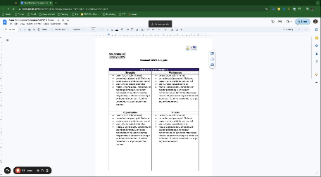

# Assignment 1: Personal SWOT

---

In this assignment, you will create a personal SWOT analysis and set goals for your next industry experience. 

### A Personal SWOT Analysis

> 📺 Watch the video to learn how to conduct a personal SWOT analysis (2:20)

 

  <iframe width="560" height="315" src="https://www.youtube.com/embed/PBOtnyt7BP4?si=rwyI338CDTNqML0X" title="YouTube video player" frameborder="0" allow="accelerometer; autoplay; clipboard-write; encrypted-media; gyroscope; picture-in-picture; web-share" allowfullscreen style="position: absolute; top: 0; left: 0; width: 100%; height: 100%;"></iframe>

> 📖 Read: [Using a SWOT Analysis in Your Career Planning](https://www.livecareer.com/resources/careers/planning/swot-analysis)

### Step 1: Create your personal SWOT analysis

You’ve already considered your strengths, weaknesses, and purpose. To finish your SWOT analysis, you will need to consider opportunities and threats, as described in the resources above. 

To complete this assignment, [make a copy of this template](https://docs.google.com/document/d/1JWTDogl3sAWB3MFIRU-08Czh5cvBnBRn7-sAdLhMY0E/copy) and add your SWOT analysis on page 1

### Step 2: Action Plan

The final step of this assignment is creating some goals for your industry experience period. The goals you set should be related to your SWOT, and the things that matter to you. 

As you complete the action items, ensure that your goals are SMART i.e.

- Specific: What do I want to learn?
- Measurable: How will I know you have achieved my goal?
- Attainable:  How will I do it?
- Realistic: How will I do it given my current responsibilities, needs, etc.?
- Time-Bound: When is the deadline to achieve my goal?

As you complete the action items, ensure that your goals are SMART i.e.

- Specific: What do I want to learn?
- Measurable: How will I know you have achieved my goal?
- Attainable:  How will I do it?
- Realistic: How will I do it given my current responsibilities, needs, etc.?
- Time-Bound: When is the deadline to achieve my goal?

    
Optional: Need a refresher on setting and accomplishing SMART goals?

     
    - 📺 Watch <a href="https://www.youtube.com/watch?v=XpKvs-apvOs" target="_blank">this video </a> on goal setting 
    - 📺 Watch <a href="https://www.youtube.com/watch?v=QXd6jeDElWM" target="_blank"> this video</a> on using habits and systems to achieve your goals
     

 
### Submission

1. Submit a link to your document on Gradescope. Ensure the document is set to enable anyone at Kibo to comment. See below for a demo of how to change sharing settings. 
     
2. Download a PDF, and upload to Anchor. 
    - To download a PDF from Google Docs, select **File** then **Download** then **PDF**
