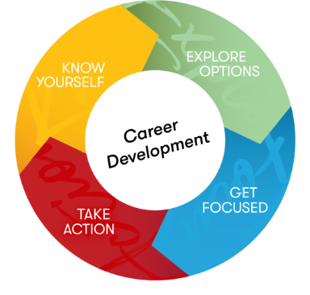

# Owning Your Career Development 

<aside>
🗣 “I am not a product of my circumstances. I am a product of my decisions.”

— Stephen Covey

</aside>

In the last lesson, we learned that careers are rarely linear, and that the "career ladder" is a poor analogy for thinking of your career. As the video emphasized, the most important thing is to get on your "career wall" and, as you gather experiences along the way, figure out the right path. Choosing a career is not a one-time decision. Having many jobs roles or functions is a normal part of **career development.** 

Before defining what career development is, let’s start with what it is not. There are a lot of misconceptions about what it takes to craft a rewarding career. For starters, career development is **not**:

- Deciding what you want to do for the rest of your life
- Applying for or getting a job
- Creating a rigid timeline and/or defined job progression for your career

> 💡 Career development is a lifelong, intentional process of managing one’s work and learning experiences. It involves continuously exploring, experiencing, and evaluating professional opportunities.

The illustration above breaks the career development cycle into four parts. Before we delve into each part, note that the image is cyclical. As the definition states, career development is a **lifelong process** that involves **continuous** **action**. The career development cycle includes:

- **Know yourself:** developing self-awareness and honestly assessing your interests, skills and values
- **Explore options:** understanding the workforce, market realities, and your opportunities to contribute
- **Get focused:** selecting specific goals to drive your action
- **Take action:** gaining experience and reflecting on that experience so that you can deepen your self-awareness

## Four Ideas to Guide Career Development

By the end of this your internships and career experiences at Kibo, we hope you will agree with four key claims.

1️⃣ **Career success is a journey, not a single destination**

Getting a job is a step towards building a career, not the ultimate goal. A successful career is an ongoing process marked by continuous adaptation.

2️⃣ **Knowing yourself is the beginning of career wisdom**

To achieve career wisdom, you must first know yourself. A fulfilling career is informed by a deep understanding of your values, interests, strengths, and weaknesses.

3️⃣ **Your professional network will power future opportunities**

Building and nurturing a strong professional network is crucial. Your network will be a source of opportunities, collaboration, and knowledge sharing. The connections you cultivate, starting with your peers, will significantly influence your professional growth and success.

4️⃣ **Experience is the best teacher**

In the early stages of your career, prioritize gaining diverse and relevant experiences. Actively seek opportunities that allow you to develop skills, explore different roles, and build a strong foundation for future career growth. As Hoffman notes, “In the world of work, you don’t know what the best plan is until you try.”

## Reflect: Experience is the best teacher 
<aside>
  Think back to your first industry experience at Kibo. What was the biggest lesson you learned about yourself? What was the biggest lesson you learned about the technology industry and/or professional life?
</aside>

<iframe src="https://padlet.com/embed/qc7l93xiopzn10cp" frameborder="0" allow="camera;microphone;geolocation" style="width:100%;height:608px;display:block;padding:0;margin:0"></iframe>

<a href="https://padlet.com?ref=embed" style="display:block;flex-grow:0;margin:0;border:none;padding:0;text-decoration:none" target="_blank">

</a>

