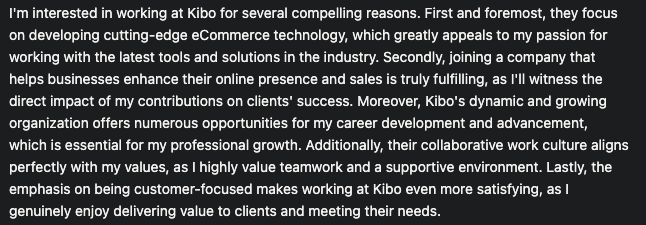
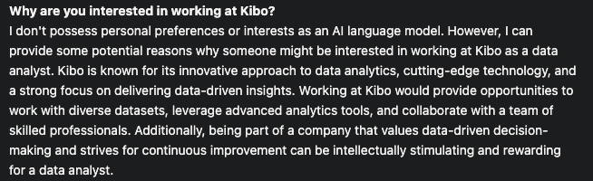
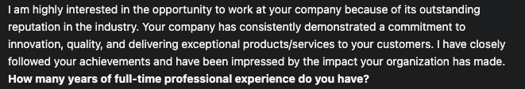
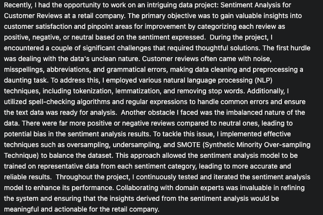
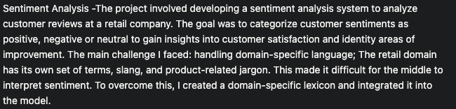
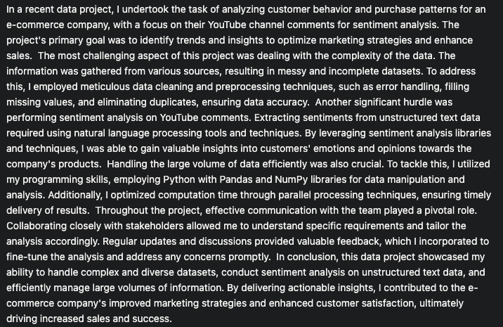
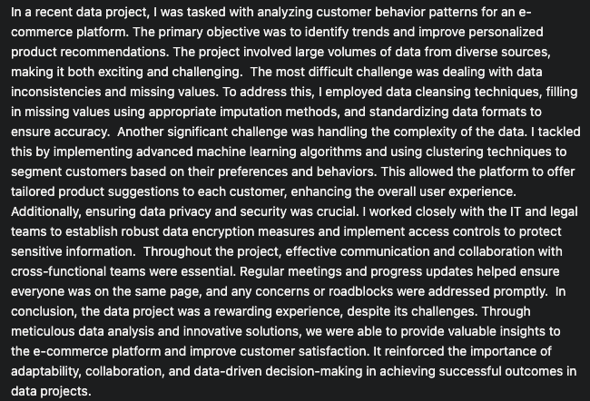
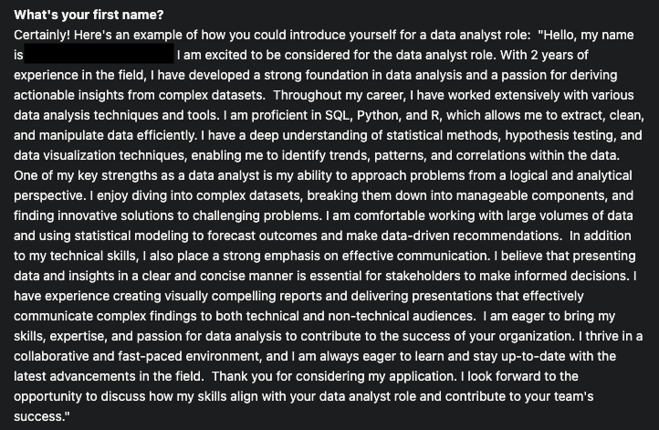

# The Perils of Using AI to Tell Your Story

---

We’ve all been there. You are scrolling through the careers page of your dream company, and you see a role that is a perfect fit for your current skills and interests. You quickly click apply, and then you see a field that says: **Upload Cover Letter (required)**. 

😡 Your excitement vanishes. You feel betrayed. You think to yourself, **“Why are they making me submit a cover letter? I don’t have time for this. This is too tedious. I’m just not going to apply.”** Or you think to yourself, **“Why are they making me submit a cover letter? I don’t have time for this. Let me just use ChatGPT, and it will write the letter for me. This will be good enough, and I will still be able to apply without going through the pain of having to write this stupid cover letter that no one is going to read anyway.”**

Before you act on either of these thoughts, I want to caution you. If an employer is requiring that you upload a cover letter or they have included screening questions that require you to submit written responses to specific prompts, there is a reason these have been included in the application. The employer wants to get some valuable data from your responses to evaluate if you are a potential good fit for the role. 

- **If you see this as a deterrent**, then the role and company probably aren’t a good fit for you because the actual job will require way more effort than answering a few questions or writing a cover letter. There is almost no job in the tech industry that doesn’t include a large amount of written communication. So if you are unwilling to demonstrate this minimal effort in the application stage, you are likely not going to keep up with the writing demands of the job.
- **If you see this as an opportunity to use a Generative AI tool to do this writing task for you**, be very careful. These writing tasks are a chance to showcase your unique experience and skills. Used poorly, the output of tools like ChatGPT is generic and easily recognizable, especially to someone who is reviewing tens, hundreds, or thousands of applications for a single role.

Let’s explore what can happen when a job applicant uses ChatGPT to answer screening questions. 

> **Case Study: Using ChatGPT When Applying for an Operations Data Analyst Role at Kibo School**
>
>In mid-2023, Kibo School began recruiting for a new member to join the Data & Operations team. The initial application asked for basic demographic information, links to the candidate's LinkedIn and resume, and answers to a number of screening questions. The following two screening questions were specifically designed to assess 1) if the candidate might be a good culture fit, 2) if they have the relevant prior experience, and 3) if their written communication skills met our expectations:
>- Why are you interested in working at Kibo?
>- Please share details about a recent data project you've worked on. What were the most difficult challenges, and how did you handle them?
>
>Hundreds of applications were submitted each day, and a single hiring manager was tasked with reviewing them and identifying a shortlist of <10 candidates to move on to the interview stage. 
>
>Below, you will see some submissions that attempted to use ChatGPT (or another AI tool) to answer the questions for them. As you read through these examples, reflect on the mistakes that these candidates made and how their submissions were received by the hiring manager. Also, reflect on if you are able to tell that an AI tool was used to generate these responses.

**Here are some real submissions to the first question: Why are you interested in working at Kibo?**

  

  

  

  

**Here are some real submissions to the second question: Please share details about a recent data project you've worked on. What were the most difficult challenges, and how did you handle them?**

  

  

  

  

  

**Also, here is a real submission to the question: What is your first name?**

  

## Discuss

> ❓ Reflect on the submissions given above and answer the following questions in the padlet below.
> - What mistakes did these candidates make in their submissions?
> - Just by reading the submissions, could you confidently determine that each of these submissions was made using an AI tool?
> -  How do you think the submissions were received by the hiring manager?

<iframe src="https://padlet.com/embed/e57gmqvogtzxy1ci" frameborder="0" allow="camera;microphone;geolocation" style="width:100%;height:708px;display:block;padding:0;margin:0"></iframe>

## Dear ChatGPT-Wiz, Proceed With Caution!

After reading through the above examples, it’s tempting to think that these candidates are just not very skilled and they used ChatGPT poorly. You might think that you can get away with using ChatGPT because you are more skilled at using it. However, unless you have the correct mindset around AI use (see below for more on this), it will be very easy to know that you have used it, and you will be severely disadvantaged. In fact, AI isn’t actually the issue. It has just worsened a job application issue that has been around for a long time: **the need to stand out in an ocean of applications.**

Top companies receive thousands of applications for each job posting that they put up. Back in 2019, Google received over 125,000 applications for its internship program ([source](https://www.cnn.com/2019/10/02/success/google-intern/index.html)). Back in 2019, there was no ChatGPT to help applicants write resumes, cover letters, or other application materials. Yet, the need to stand out from the crowd, be seen, and (most importantly) be remembered was critical. 

Today, the number of people applying for each job or internship role is probably much higher than it was back in 2019. And worse still, a large majority are using the same AI-powered arsenal to spray and pray their applications across multitudes of roles and big and small companies.  The result is that all candidates look the same. If you also employ AI tools, you will just blend into the vast applicant ocean with the rest of the candidates. 

Moreover, using AI to write your application materials sends a strong negative signal to employers that either your written communication skills are weak, or you don’t have enough initiative or care enough about the role to write your own application materials yourself. This will make you stand out for the wrong reason and will result in instant disqualification from the hiring process. 

Recognizing when AI has been used to write job application materials is surprisingly obvious, especially to hiring managers who have been exposed to large numbers of these materials over their careers. Here are some tell-tale signs of AI use (in this case, we are focusing on cover letters). Full disclosure: this list was generated by ChatGPT 😉.

1. **Generic or Overused Phrases:** If the cover letter contains generic phrases or clichés commonly found in template-based writing, it could suggest the use of automated assistance.
2. **Inconsistent Tone or Style:** If there are abrupt shifts in tone or writing style throughout the cover letter, it might indicate the integration of different suggestions or paragraphs generated by an AI.
3. **Unusual or Excessive Jargon:** The use of complex or industry-specific jargon that doesn't align with the candidate's background or the job description may be a red flag.
4. **Lack of Personalization:** If the cover letter lacks personalization and doesn't address specific details about the company or job position, it might indicate a template-based approach, including AI-generated content.
5. **Unrealistic or Hyperbolic Claims:** The presence of overly ambitious or exaggerated claims that seem out of place for the candidate's experience may suggest the influence of AI-generated content.
6. **Incoherent or Irrelevant Content:** If the cover letter includes sections that are irrelevant to the job or industry, or if there's a lack of logical flow, it could indicate the incorporation of AI-generated text.

Even if you adapt the output of an AI tool so that your final document doesn’t suffer from the above tell-tale signs, remember that while you only see your submission, remember that a hiring manager or recruiter is viewing hundreds or thousands of submissions. Therefore, they can see patterns that emerge, indicating the wide use of AI tools by job applicants. Standing out is one of your key goals when applying for a job, and telling your story in a unique and authentic way is the greatest weapon you have to stand out. **Don’t waste this opportunity to stand out and showcase yourself by relying on generic AI-written content. It will not help you land the job (or even an interview), and it will waste everyone’s time.**
